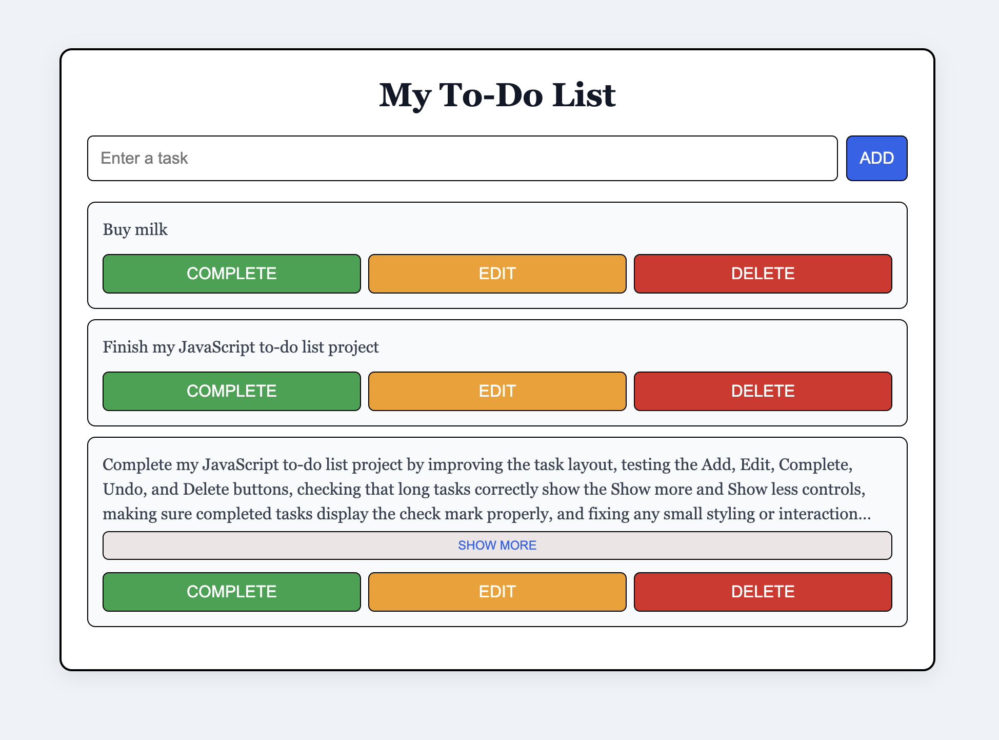

# To-Do List

A simple and clean to-do list web app built with HTML, CSS, and JavaScript.

## Live Site

[View Live Site]((https://tacesept.github.io/todo-app-html-css-js/))

## Preview

## Features

- Add new tasks
- Edit existing tasks
- Mark tasks as complete
- Undo completed tasks
- Delete tasks
- Show more / Show less for long tasks
- Visual check mark for completed tasks
- Press Enter to quickly add a task

## Built With

- HTML
- CSS
- JavaScript

## Project

This project was built to practice DOM manipulation, event listeners, and creating interactive UI elements with JavaScript.
